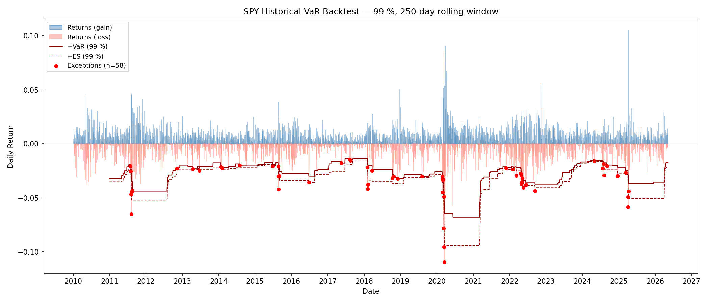

# VaR Backtesting Library

Historical 1-day Value-at-Risk (VaR) backtesting on SPY daily returns using a
250-day rolling window at 99 % confidence.  The library identifies VaR breaches
(exceptions) and evaluates the model with the Kupiec unconditional coverage
test, the Christoffersen independence test, and the Basel traffic-light
classification.

> *Built as a self-study project for transition to quantitative finance.
> Not a production system.*

---

## What it does

1. Downloads SPY daily returns via `yfinance` (cached as CSV after the first run).
2. Estimates a rolling 1-day 99 % historical VaR with a 250-day window.
3. Identifies exceptions — days where the realised loss exceeded the prior day's VaR.
4. Runs statistical tests for correct coverage and independence of exceptions.
5. Classifies the model under the Basel traffic-light framework.
6. Produces a single plot of returns, the VaR line, and exception markers.

---

## Math

### Historical VaR

Given the most recent $T = 250$ daily returns $r_1, \ldots, r_T$, the 1-day
historical VaR at confidence level $\alpha$ is:

$$\text{VaR}_\alpha = -Q_{1-\alpha}(r_1, \ldots, r_T)$$

where $Q_{1-\alpha}$ is the $(1-\alpha)$-th empirical quantile.
Sign convention: VaR is positive; it represents the loss magnitude.
A VaR of 2 % means the model estimates a 1 % probability of losing more than
2 % on the next trading day.

### Kupiec Unconditional Coverage Test

*(Kupiec 1995)*
Tests whether the observed exception rate $\hat{p} = N/T$ matches the expected
rate $p = 1 - \alpha$.  Large deviations in either direction indicate model
misspecification.

$$LR_{\text{uc}} = -2 \ln\!\left[
    \frac{(1-p)^{T-N}\, p^N}{\left(1-\frac{N}{T}\right)^{T-N}
    \left(\frac{N}{T}\right)^N}
\right]$$

Under $H_0$ (correct coverage), $LR_{\text{uc}} \sim \chi^2(1)$.

### Christoffersen Independence Test

*(Christoffersen 1998)*
Tests whether exceptions are independently distributed over time.  Clustering
suggests the model underestimates risk during turbulent periods.
Let $n_{ij}$ count one-step transitions from state $i$ to state $j$ in the
exception indicator sequence.

$$\hat{\pi}_{01} = \frac{n_{01}}{n_{00}+n_{01}},\quad
  \hat{\pi}_{11} = \frac{n_{11}}{n_{10}+n_{11}},\quad
  \hat{\pi}   = \frac{n_{01}+n_{11}}{n_{00}+n_{01}+n_{10}+n_{11}}$$

$$LR_{\text{ind}} = -2 \ln\!\left[
    \frac{(1-\hat{\pi})^{n_{00}+n_{10}}\,\hat{\pi}^{n_{01}+n_{11}}}{
          (1-\hat{\pi}_{01})^{n_{00}}\,\hat{\pi}_{01}^{n_{01}}\,
          (1-\hat{\pi}_{11})^{n_{10}}\,\hat{\pi}_{11}^{n_{11}}}
\right]$$

Under $H_0$ (independence), $LR_{\text{ind}} \sim \chi^2(1)$.

### Conditional Coverage Test

Combines both tests into a joint evaluation:

$$LR_{\text{cc}} = LR_{\text{uc}} + LR_{\text{ind}} \sim \chi^2(2)$$

A rejection means the model fails on correct coverage, independence, or both.

### Expected Shortfall (Conditional VaR)

Expected Shortfall (ES, also called Conditional VaR or CVaR) is the expected
loss *conditional* on the loss exceeding the VaR threshold.  It is a coherent
risk measure — unlike VaR it accounts for the severity of losses in the tail,
not just the frequency.  ES is the regulatory standard under Basel IV / FRTB.

$$\text{ES}_\alpha = -\mathbb{E}\bigl[r \mid r \leq -\text{VaR}_\alpha\bigr]
= -\frac{1}{|\mathcal{T}|} \sum_{r \in \mathcal{T}} r$$

where $\mathcal{T} = \{r \in \text{rolling window} : r \leq Q_{1-\alpha}\}$.
Sign convention: ES is positive, representing the expected loss magnitude.
ES $\geq$ VaR always holds by construction.

### Basel Traffic-Light

Under the Basel II/III internal models approach, the number of exceptions over
250 trading days at 99 % VaR determines a supervisory capital multiplier:

| Exceptions | Zone   | Interpretation                        |
|:----------:|--------|---------------------------------------|
| 0 – 4      | Green  | Model is acceptable                   |
| 5 – 9      | Yellow | Possible problems; review required    |
| ≥ 10       | Red    | Model presumed inadequate             |

---

## Installation

```bash
pip install -r requirements.txt
```

Python 3.10 or later is required.

---

## Running the example

```bash
python examples/run_backtest.py
```

SPY data is downloaded on first run and cached to `examples/output/spy_prices.csv`.
Delete that file to force a fresh download.

### Example summary table output

```
Backtest period : 2010-12-31 to 2026-05-11
Observations    : 3862
Exceptions      : 58  (observed rate 1.50%, expected 1.00 %)

Metric                                        Value
---------------------------------------------------
Exceptions (full period)                         58
Observations (full period)                     3862
Observed exception rate                       1.50%
---------------------------------------------------
Kupiec LR statistic                          8.5124
Kupiec p-value                               0.0035
Kupiec — reject H0 at 5 %                     True
---------------------------------------------------
Christoffersen LR statistic                 18.2891
Christoffersen p-value                       0.0000
Christoffersen — reject H0 at 5 %             True
---------------------------------------------------
Conditional coverage LR statistic           26.8016
Conditional coverage p-value                 0.0000
Conditional coverage — reject H0 at 5 %      True
---------------------------------------------------
Basel zone (last 250 days, N=0)              GREEN
---------------------------------------------------
Latest VaR estimate                           1.75%
Latest ES  estimate                           2.17%
ES / VaR ratio (latest)                       1.25x
---------------------------------------------------
Average rolling VaR (full period)             2.88%
Average rolling ES  (full period)             3.55%
ES / VaR ratio (average)                      1.23x
---------------------------------------------------

Last 250 Trading Days — Regulatory Window
---------------------------------------------------
Exceptions (last 250 days)                        0
Observed exception rate                       0.00%
---------------------------------------------------
Kupiec LR statistic                          5.0252
Kupiec p-value                               0.0250
Kupiec — reject H0 at 5 %                     True
---------------------------------------------------
Christoffersen LR statistic                  0.0000
Christoffersen p-value                       1.0000
Christoffersen — reject H0 at 5 %            False
---------------------------------------------------
Conditional coverage LR statistic            5.0252
Conditional coverage p-value                 0.0811
Conditional coverage — reject H0 at 5 %     False
---------------------------------------------------
Basel zone (N=0)                             GREEN
---------------------------------------------------
```

### Example plot

The plot is written to `examples/output/backtest_plot.png`:



---

## Running tests

```bash
pytest
```

All tests run without network access; only `examples/run_backtest.py` requires
internet connectivity (or a cached CSV).

---

## Project structure

```
var_backtest/
├── __init__.py
├── data.py        # SPY download and CSV caching
├── var.py         # rolling historical VaR
├── es.py          # rolling historical ES
├── exceptions.py  # exception identification
├── tests.py       # Kupiec, Christoffersen, conditional coverage
├── basel.py       # traffic-light classification
└── plotting.py    # backtest plot
examples/
├── run_backtest.py
└── output/
    └── backtest_plot.png   (generated)
tests/
├── test_var.py
├── test_es.py
├── test_kupiec.py
├── test_christoffersen.py
└── test_basel.py
```

---

## Results interpretation (SPY 2011–2026)

### What model is being tested?

**Historical Simulation VaR** — the simplest VaR model.  Each day, look back
at the last 250 actual SPY returns, take the 1st percentile, and declare that
as tomorrow's loss threshold.  No distribution assumption, no formula — just
raw historical data equally weighted.

### Full-period results (3 862 days)

**58 exceptions, 1.50 % observed vs 1.00 % expected.**

- **Kupiec rejects (p = 0.0035):** the model produced ~50 % too many
  exceptions.  It systematically understated tail risk.
- **Christoffersen rejects (p ≈ 0):** exceptions are not independent — they
  cluster.  During COVID (March 2020), the 2022 rate-hike selloff, and the
  April 2025 tariff shock, multiple exceptions occurred in quick succession.
  A flat equal-weight window reacts too slowly to volatility regime changes.
- **Conditional coverage rejects:** the model fails on both frequency and
  time-distribution simultaneously.

### Last-250-day results (May 2025 – May 2026)

**0 exceptions → Basel GREEN.**

The worst day in this window was only −2.70 %, while the VaR stood at ~3.70 %.
This is not because the market was calm — April 2025 saw a sharp SPY selloff
of ~10 % from tariff announcements.  Those crash days fell just *outside* the
Basel 250-day window, so they are not counted as exceptions.  However, they
*are* inside the rolling VaR estimation window, which inflated VaR to 3.7 %
— making every subsequent day look safe by comparison.

This is the **"ghost of past crises" effect** inherent to flat-window
historical simulation: the model becomes most conservative *after* a crisis,
not during it.

```
April 2025 crash → exceptions occur (outside Basel window, not penalised)
                 → VaR spikes to ~3.70 % (crash days inside rolling window)
                 → Subsequent losses of ~2 % safely below the 3.70 % bar
                 → Basel GREEN for the following year
```

### Key takeaway

Basel GREEN in a calm post-crisis window is **necessary but not sufficient**
evidence that a VaR model is well-specified.  Kupiec and Christoffersen provide
a more honest long-run evaluation.  The natural fix is EWMA-weighted historical
simulation or GARCH-filtered HS, which respond faster to volatility regime
changes instead of waiting for a crisis to roll out of the 250-day window.

> *"The model is like a weather forecaster who predicts rain based only on
> historical averages — and ignores the storm clouds currently on the radar."*

---

## Future work

- **ES backtesting** — formal backtests for Expected Shortfall (e.g. McNeil
  & Frey 2000, Acerbi & Szekely 2014).
- **Multi-horizon VaR** — extend to 5-day and 10-day horizons using the
  square-root-of-time rule or filtered historical simulation.
- **EWMA-weighted historical simulation** — assign higher weight to recent
  observations to speed up the model's response to volatility regime changes.

---

## References

- Kupiec, P. (1995). "Techniques for Verifying the Accuracy of Risk Measurement Models." *Journal of Derivatives*, 3(2), 73–84.
- Christoffersen, P. (1998). "Evaluating Interval Forecasts." *International Economic Review*, 39(4), 841–862.
- Basel Committee on Banking Supervision (1996). *Amendment to the Capital Accord to Incorporate Market Risks.*
